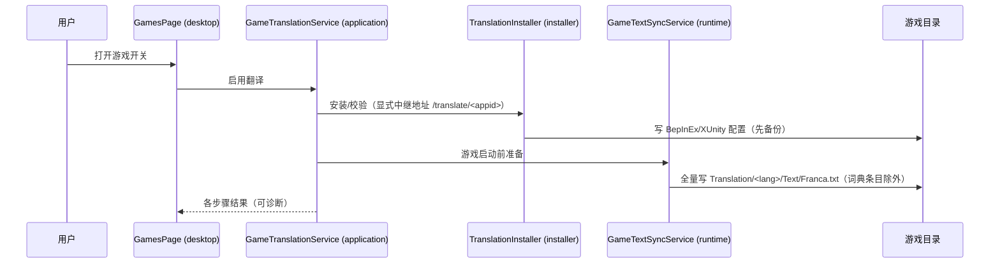
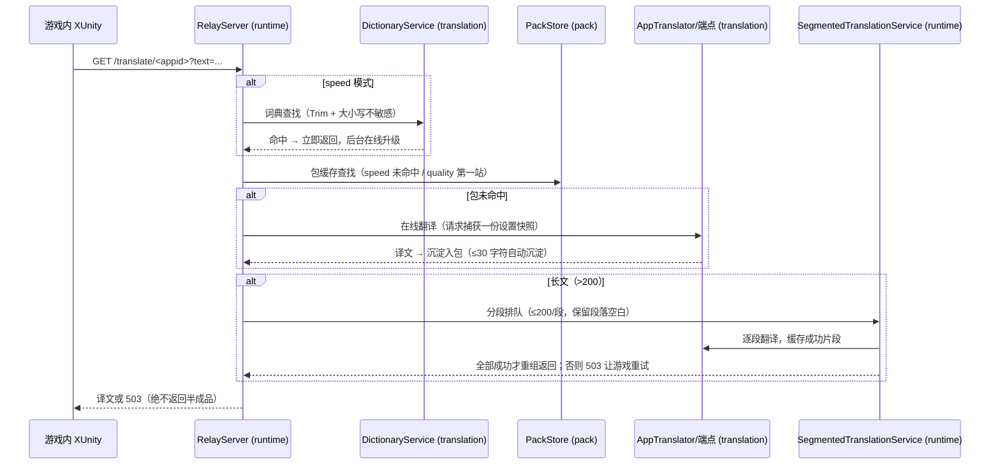
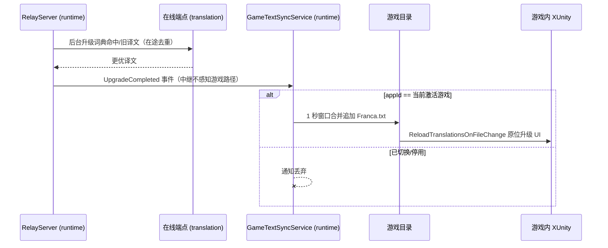
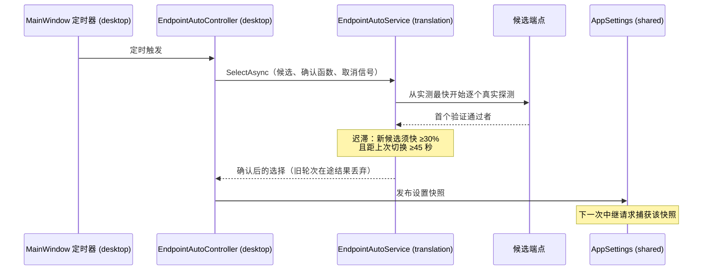

# Franca 蓝图：关键数据流

> 手写维护。只画钱路径，流程变更时更新本文件；模块边界与依赖图以自动生成的 [BLUEPRINT.md](BLUEPRINT.md) 为准。参与者括号内为模块 id，与 `architecture.json` 对齐。

## 1. 启用翻译

```mermaid
sequenceDiagram
    participant U as 用户
    participant P as GamesPage (desktop)
    participant G as GameTranslationService (application)
    participant I as TranslationInstaller (installer)
    participant S as GameTextSyncService (runtime)
    participant D as 游戏目录

    U->>P: 打开游戏开关
    P->>G: 启用翻译
    G->>I: 安装/校验（显式中继地址 /translate/<appid>）
    I->>D: 写 BepInEx/XUnity 配置（先备份）
    G->>S: 游戏启动前准备
    S->>D: 全量写 Translation/<lang>/Text/Franca.txt（词典条目除外）
    G-->>P: 各步骤结果（可诊断）
```

## 2. 游戏内请求分流

```mermaid
sequenceDiagram
    participant X as 游戏内 XUnity
    participant R as RelayServer (runtime)
    participant Dict as DictionaryService (translation)
    participant P as PackStore (pack)
    participant T as AppTranslator/端点 (translation)
    participant Q as SegmentedTranslationService (runtime)

    X->>R: GET /translate/<appid>?text=...
    alt speed 模式
        R->>Dict: 词典查找（Trim + 大小写不敏感）
        Dict-->>R: 命中 → 立即返回，后台在线升级
    end
    R->>P: 包缓存查找（speed 未命中 / quality 第一站）
    alt 包未命中
        R->>T: 在线翻译（请求捕获一份设置快照）
        T-->>R: 译文 → 沉淀入包（≤30 字符自动沉淀）
    end
    alt 长文（>200）
        R->>Q: 分段排队（≤200/段，保留段落空白）
        Q->>T: 逐段翻译，缓存成功片段
        Q-->>R: 全部成功才重组返回；否则 503 让游戏重试
    end
    R-->>X: 译文或 503（绝不返回半成品）
```

## 3. 运行时升级链路

```mermaid
sequenceDiagram
    participant R as RelayServer (runtime)
    participant T as 在线端点 (translation)
    participant S as GameTextSyncService (runtime)
    participant D as 游戏目录
    participant X as 游戏内 XUnity

    R->>T: 后台升级词典命中/旧译文（在途去重）
    T-->>R: 更优译文
    R->>S: UpgradeCompleted 事件（中继不感知游戏路径）
    alt appId == 当前激活游戏
        S->>D: 1 秒窗口合并追加 Franca.txt
        D->>X: ReloadTranslationsOnFileChange 原位升级 UI
    else 已切换/停用
        S--xS: 通知丢弃
    end
```

## 4. 自动端点选择

```mermaid
sequenceDiagram
    participant W as MainWindow 定时器 (desktop)
    participant C as EndpointAutoController (desktop)
    participant A as EndpointAutoService (translation)
    participant E as 候选端点
    participant S as AppSettings (shared)

    W->>C: 定时触发
    C->>A: SelectAsync（候选、确认函数、取消信号）
    A->>E: 从实测最快开始逐个真实探测
    E-->>A: 首个验证通过者
    Note over A: 迟滞：新候选须快 ≥30%<br/>且距上次切换 ≥45 秒
    A-->>C: 确认后的选择（旧轮次在途结果丢弃）
    C->>S: 发布设置快照
    Note over S: 下一次中继请求捕获该快照
```
